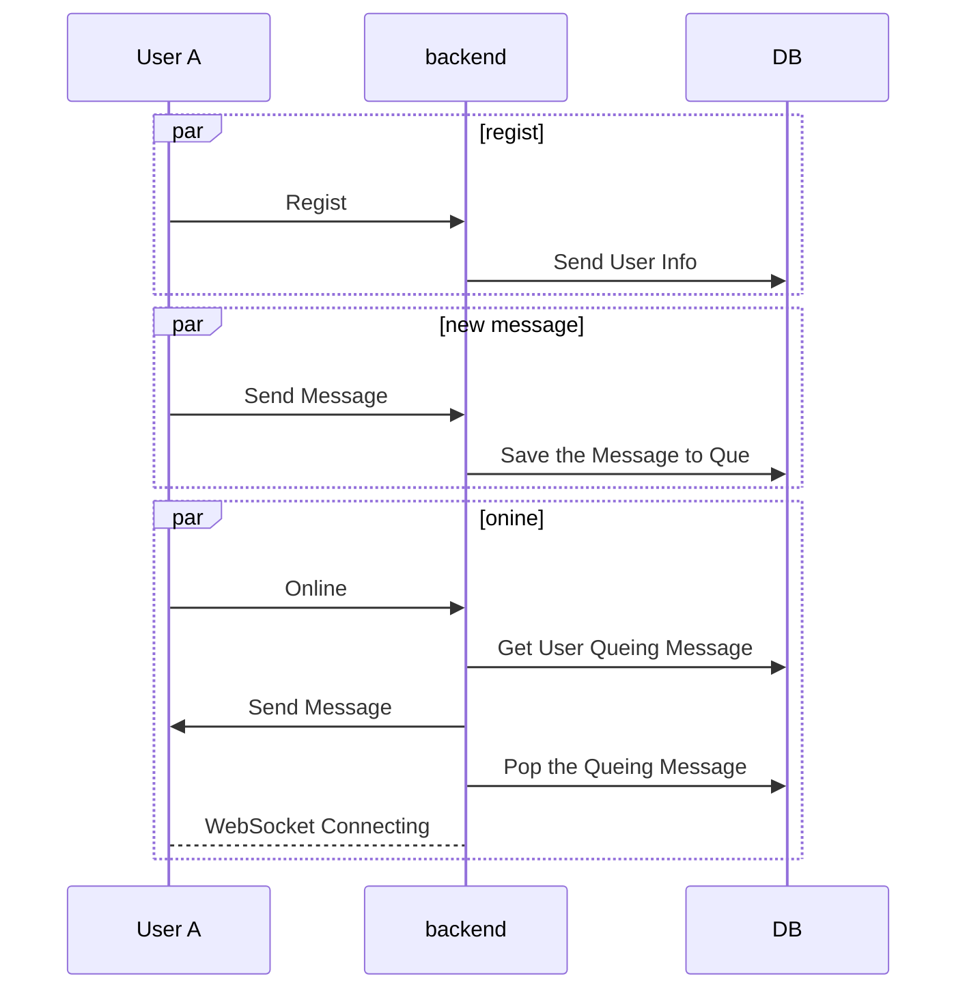

# chat_room

## Flow Diagram

```mermaid
sequenceDiagram
participant User A 
participant backend
participant DB
par regist
    User A->>backend: Regist
    backend->>DB: Send User Info
end
par new message
    User A->>backend: Send Message
    backend->>DB: Save the Message to Que
end
par onine
    User A->>backend: Online
    backend->>DB: Get User Queing Message
    backend->>User A: Send Message
    backend->>DB: Pop the Queing Message
    User A-->backend: WebSocket Connecting
end
```

## Package Expect:

### dependency
- express
- mongoDB
- socket.io
- minio
### other tool
- morgan
- cors
- swagger
- mongoose